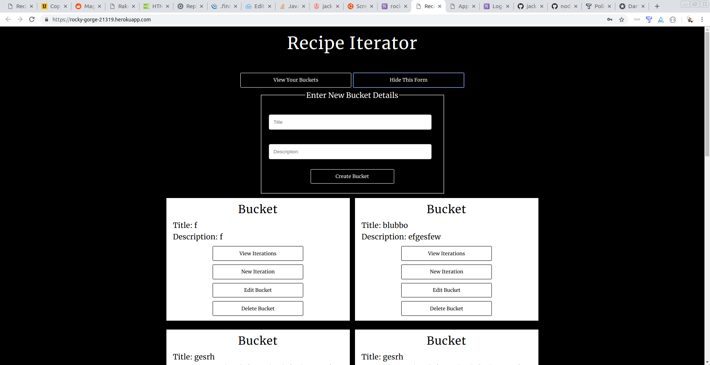
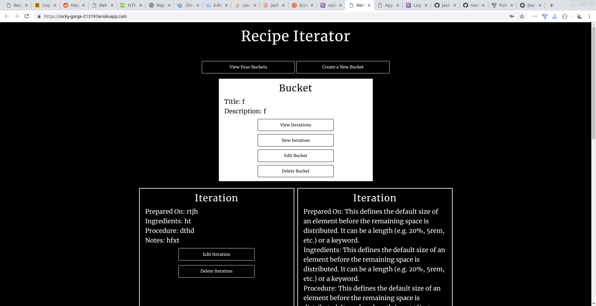

Recipe Iterator

may be found at https://rocky-gorge-21319.herokuapp.com/

This app allows the user to create an account and log in 

It then allows you to view buckets, which are akin to database folders, using form submission 

Iterations, akin to files in a folder, can be viewed, created, and edited with forms as well. 

I designed this app with serious kitchen work in mind, a spiral notebook with redundancy and the ability to seen anywhere.

This app uses javaScript, html and css for the frontend, jQuery, node.js, express, mongo/oose, travisCl, mocha and chai for testing, and heroku for deployment. 